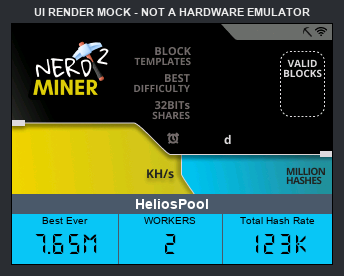
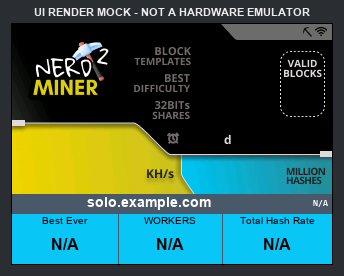
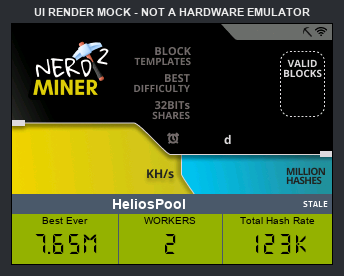

# Dashboard UI render mocks

These PNG files are **UI render mocks, not ESP32 emulator or physical-device
captures**. They are generated by `tools/render_pool_panel.py` from:

- the actual 320x170 RGB565 `MinerScreen` array in
  `src/media/images_320_170.h`;
- the embedded `DigitalNumbers` font data in `src/media/myFonts.h`;
- the exact 320x240 target dimensions, panel coordinates, RGB565 colors,
  column boundaries, labels, and example state strings used by the production
  display driver.

Desktop Arial is used to approximate TFT_eSPI's built-in text fonts for the
pool name, labels, state, and `N/A`. Small rasterization differences from the
physical TFT are expected.

## HeliosPool, current, blue theme

## Public Pool, current, green theme

## Unsupported custom pool

## Last-good data marked stale

